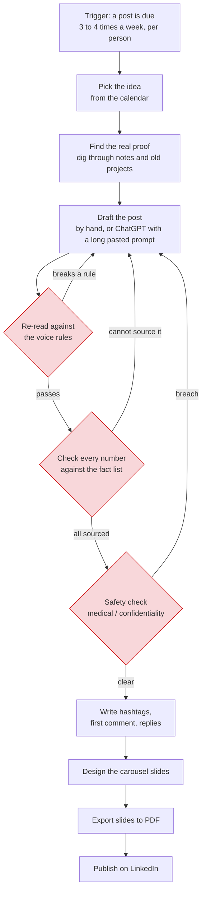
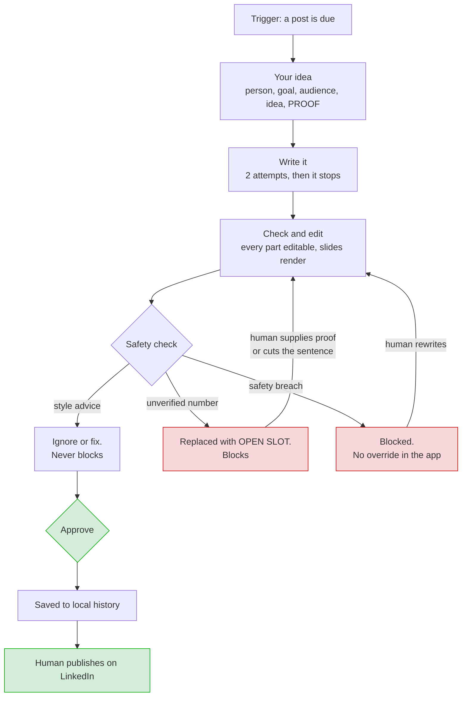

# Workflow map

The work before, and the work now.

All timings are estimates from memory, recorded in Ali's own case study in
August 2026. None is a stopwatch measurement, and none is presented as one.

There are **three** states here, not two, and the distinction matters. The large
time saving belongs to the middle one, which predates this Quest.

---

## State 1. By hand, before the engines existed

**The three red boxes are the bottleneck.** Not the drafting. Each one is a manual
re-read of the whole piece, looking for a different kind of problem, and each one
can send you back to the start.

| Step | Who does it | Notes |
| --- | --- | --- |
| Pick the idea | Human | |
| Find the proof | Human | The digging step |
| Draft | Human | |
| **Voice re-read** | Human | Loops back |
| **Number check** | Human | Loops back |
| **Safety check** | Human | Loops back |
| Hashtags, comments, replies | Human | |
| Carousel design | Human | |
| Export | Human | |
| **Total** | | **30 to 60 minutes per post.** Estimate from memory |

**Volume:** 3 posts a week for Ali, 4 a week for each of the other two people.

### Exceptions in the old process

- **The proof does not exist.** Realised halfway through drafting. Either the post
  gets rewritten around a different angle or it gets dropped.
- **A number cannot be sourced.** Same outcome: rewrite or cut.
- **The safety issue is found late**, after the carousel is already designed. Then
  the slides get redone too.

---

## State 2. With the content engines, before this app

One written engine document per person: voice rules, verified fact table, banned
phrasings, hashtag rules, safety limits. Run as a Claude Project.

The calendar is dictated with Wispr Flow, a month to three months of rows in a
single 30 to 60 minute sitting. Then a row is named and the engine writes the
package.

**Review time: about 5 minutes per post. Ali writes nothing by hand.**

**This is where the large time saving happened, and it predates this Quest.**

What it still could not do:

| Limitation | Why it matters |
| --- | --- |
| The rules are text the model is asked to obey | It usually does. When it does not, nothing catches it except a human re-read |
| Assets need Code Execution enabled | The PDF step fails silently in a tool without file execution |
| Nothing is testable | No way to answer "is this better than asking the model politely" except by feeling |

## State 3. The same engines as software: this app

**What moved from State 2.** The rules stopped being text the model is asked to obey and became code that runs every time. The assets render locally in about a second with no external service. And the whole thing became measurable.

**What did not move.** Review time. It was about 5 minutes in State 2 and it is about 5 minutes now. This system is not aimed at speed.

**What moved from State 1.** The three manual re-reads became one automatic check. The human
work that remains is the work that needs judgement: choosing the idea, supplying
the proof, and deciding whether a flagged sentence gets a real number or gets cut.

**What did not move.** Publishing. A human still presses publish on LinkedIn,
every time, outside the app.

| Step | Who does it | Notes |
| --- | --- | --- |
| Brief | Human | The proof box is the grounding contract |
| Generate | System | 2 attempts maximum |
| Edit | Human | Optional |
| Style check | System | Advice only |
| Fact check | System | Removes unverified numbers. Blocks |
| Safety check | System | Blocks. Cannot be overridden in the app |
| Resolve a block | Human | Supply proof, or cut the sentence |
| Approve | Human | Only possible when nothing blocks |
| Carousel slides and PDF | System | Local, about one second |
| Publish | Human | Outside the app |

---

## Where a human must still decide

| Decision | Why it stays human |
| --- | --- |
| Which idea, and what proof it rests on | This is the thinking. The system has no view on it |
| Whether an open slot gets a real number or the sentence gets cut | Only a person knows if the number exists |
| Whether to accept a style warning | Voice is a judgement |
| Whether a safety block is correct | The system holds the line. Changing it is a rule change, made outside the app, in conversation with the person it protects |
| Publishing | Always |

---

## Input variation the system has to handle

| Variation | How it is handled |
| --- | --- |
| Brief with full proof | Normal path |
| Brief with no proof | Open slots inserted, approval blocked, stated up front in the brief screen |
| Brief asking for something unpublishable | Blocked at QA. Tested by 13 of the 20 evaluation cases |
| Three different people with three different rule sets | One persona specification per person. The checker reads the rules from it, so a new person cannot silently skip a guardrail |
| A person with no numbers in their evidence at all | Handled. Evidence can be a real remembered moment. Tested by case G04 |
| Model returns malformed JSON | Repaired if it is a trailing comma. Otherwise one corrective retry, then a clear message |
| Model is switched off by the provider | Named in the error, with instructions to pick another. A sidebar button checks the whole list |
| No image provider configured | The picture package returns art direction and says so. It never presents a prompt as an image |
| No portrait uploaded | The author slide falls back to an initials mark |
